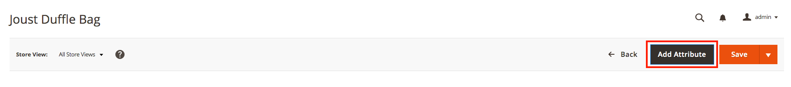
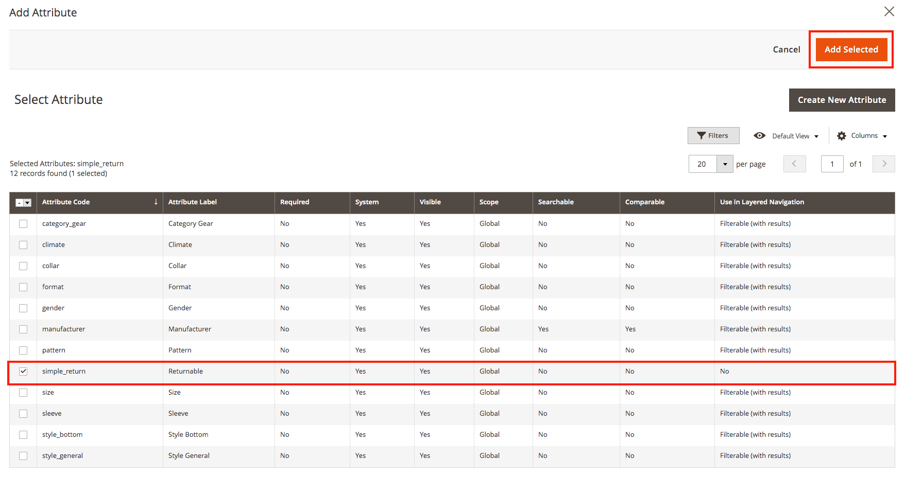
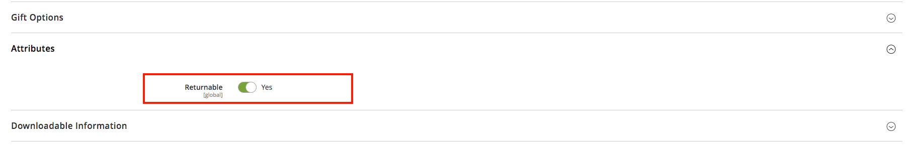
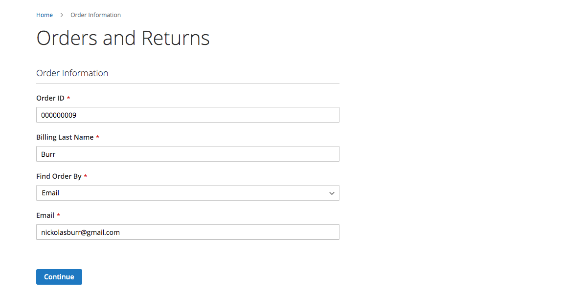
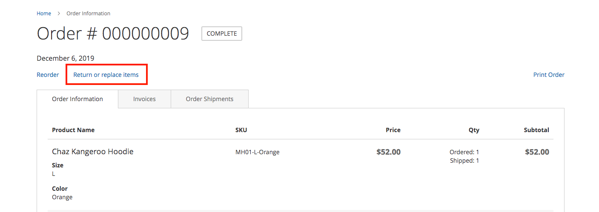
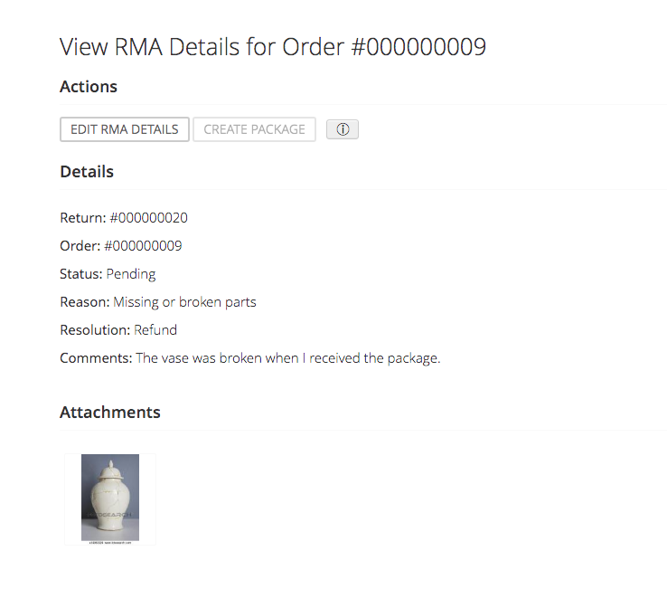
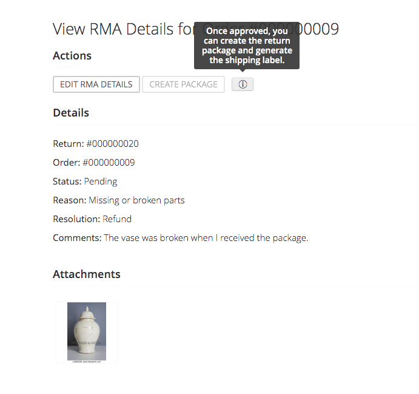
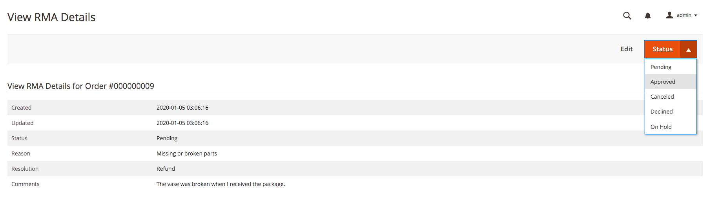
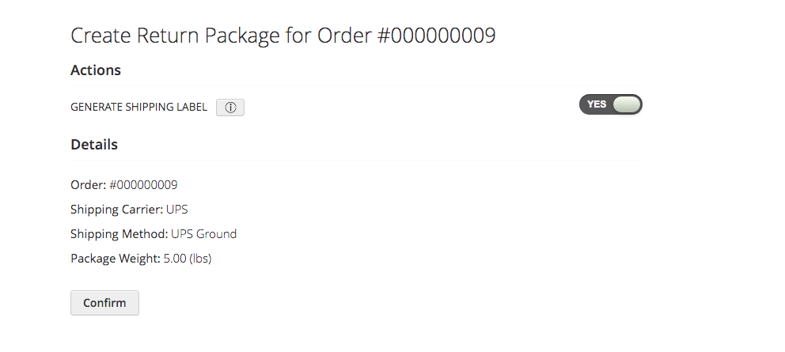
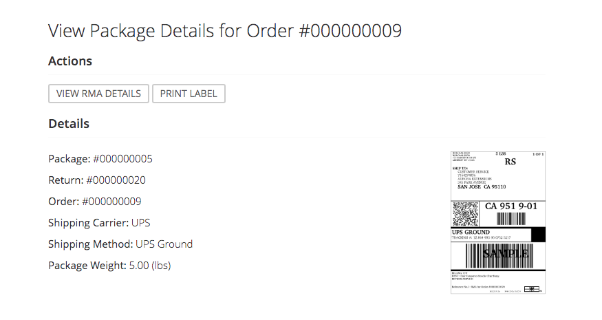

Attribute Guide
===============

This guide explains how to set the ``simple_return`` product attribute. This attribute
must be set and enabled for *each product of an order*, as required for RMA eligibility.

.. note::
    Simple Returns is an order-based RMA extension, meaning an RMA request is not specific to any
    single item, but the order as a whole. If you need itemized and/or partial returns capabilities,
    please check out our premium RMA extension, Simple Returns Pro. It provides all of the features
    of Simple Returns with several added features like itemized and partial returns, RMA archives,
    and lockable RMAs to prevent customers from editing, just to name a few.

Table of Contents
-----------------

- `Prerequisites`_
- `Attribute`_
    - `Step One: Add Attribute`_
    - `Step Two: Reindex Products`_
    - `Step Three: Update Attribute`_
    - `Step Four: Test an order [Optional]`_

Prerequisites
-------------

Before starting, please make sure you have completed the following steps:

* :ref:`installation`
* :ref:`configuration`

.. _attribute:

Attribute
---------

.. attention::
    This is a multi-step process. Please make sure to complete each step sequentially. If you
    encounter issues, please refer to our Troubleshooting section.

Step One: Add Attribute
^^^^^^^^^^^^^^^^^^^^^^^

To start, navigate to *Catalog* > *Products* and click on a product you would like to make returnable.

.. attention::
   For configurable products, you will need to complete this step for both the configurable product, as
   well as the associated simple product.

From the product edit page, click *Add Attribute* in the top right corner of the page.

From the attributes grid, select the checkbox for ``simple_return`` and click *Add Selected*.

Click *Save* to update the product.

Step Two: Reindex Products
^^^^^^^^^^^^^^^^^^^^^^^^^^

The next step is to reindex the products and their attributes. From the Magento root directory,
run the following command:

.. code-block:: sh

    ./bin/magento cache:clean && ./bin/magento indexer:reindex

Step Three: Update Attribute
^^^^^^^^^^^^^^^^^^^^^^^^^^^^

Once the indexer is finished, navigate back to the product edit page and look for the *Attributes*
section near the bottom of the page. Toggle open the *Attributes* section and click the *Returnable*
attribute button to enable returns for the product.

Click *Save* to update the product. You should be able to see the attribute value set to enabled
after the product is finished saving.

.. warning::
   If the attribute value is not updated after saving the product, the likely causes are:

   1. You did not complete `Step Two: Reindex Products`_
   2. The product was not successfully reindexed with the new attribute

Once you've verified the attribute value is saving properly, you can either manually update each product
you would like to make returnable, or you can perform a bulk import to save time, particularly if you're
working with a large catalog. As of right now, we do not have a formalized guide on bulk importing.

Step Four: Test an order [Optional]
^^^^^^^^^^^^^^^^^^^^^^^^^^^^^^^^^^^

This step is optional, but we recommend completing it to get an understanding of how Simple Returns on
the frontend.

To start this step, create a new order of all returnable products. There are plenty of guides on creating
test orders in Magento, so we will leave that part up to you.

.. attention::
   Please don't use an existing order, as the order items of an existing order will not have the required
   attribute saved on it.

Once you have your test order submitted, navigate to the *Orders and Returns* page on the frontend.

On the *Orders and Returns* page, fill out the relevant order information. The Order ID field should be the
nine digit order increment ID value, which was generated when the order was created.

Click *Continue* to submit the form. This will take you to the frontend order view page.

Once the order view page has loaded, you should see a new link next to the *Reorder* link. It will display
something to the effect of *Return or replace items*. Click the link, which will take you to the frontend
RMA create page.

On the *Create new RMA* page, fill out the relevant information about the RMA request and click *Submit*.

.. figure:: images/step_four_4.png
   :width: 800
   :height: 800
   :alt: Create new RMA form
   :align: center
   :figclass: align-center
   :scale: 50%

Once the RMA view page had loaded, review the information. You will not be able to generate a shipping
label until the RMA request is approved.

Keeping the RMA view page open, create a new tab in your browser. In the new tab, navigate to the Magento
backend and approve the RMA request. This will allow you to generate the package and subsequent shipping
label from the frontend like a customer.

Returning to the frontend RMA view page, reload the page and click the *Create Package* button. This will
take you to the Package create page and require you to confirm the package information. Keep the option to
*Generate Shipping Label* set to *Yes* and click *Confirm*.

Once the Package view page has loaded, you should see all of the package details along with the newly generated
shipping label.

.. warning::
   If you encounter issues when confirming the package information, it is almost always an issue communicating
   with the shipping carrier APIs. Please make sure you have properly configured the desired shipping carrier,
   your access credentials are working, and the desired shipping carrier is selected within the Simple Returns
   configuration settings.
